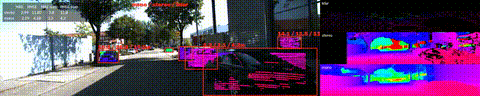

# stereo_vs_lidar

Estimate depth from stereo vision and compare against LiDAR point cloud.
Run on frame sequences from KITTY Raw datasets and produce a video(s) visualizing the two side by side.
Mean Absolute Error and Root Mean Squared Error as metrics of the diff between point cloud from lidar and depth estimated from stereo. Also, nearest distances to each bounding box as per stereo (left number) and as per lidar (right number).

## Setup

```
pip install -r requirements.txt
wget https://stereo-vision.s3.eu-west-3.amazonaws.com/yolo11n.pt
```

Run both from inside this folder (`stereo_vs_lidar/`) -- `detection.py` loads the model via the relative path `yolo11n.pt`.

## Demo



[Full video](output/preview.mp4)
